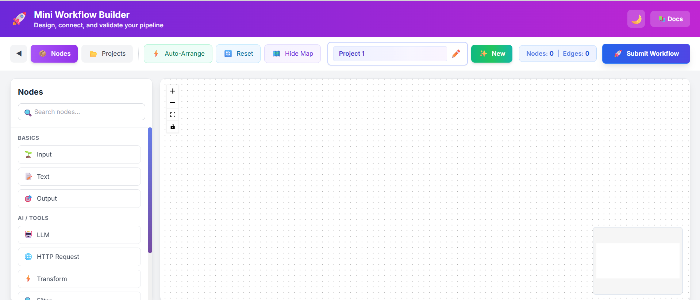
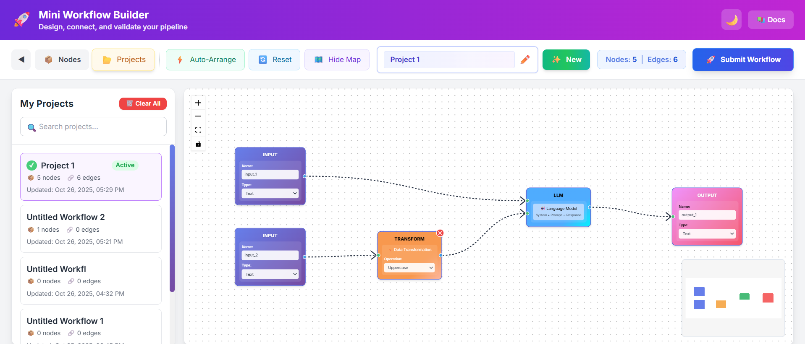

# 🚀 Mini Workflow Builder

A visual workflow builder application that allows users to design and validate data pipelines through an intuitive drag-and-drop interface.

## 📋 Overview

Mini Workflow Builder is a full-stack application that enables users to create, connect, and validate workflow pipelines. Built with React and FastAPI, it provides a powerful canvas where you can design complex data workflows by connecting various node types and validate whether your pipeline forms a valid Directed Acyclic Graph (DAG).

## ✨ Features

- **Visual Workflow Design** - Drag-and-drop interface powered by ReactFlow
- **9 Node Types** - Input, Output, LLM, Text, Transform, Filter, API, Database, and Aggregator nodes
- **DAG Validation** - Real-time validation of pipeline structure via FastAPI backend
- **Project Management** - Save, load, and delete projects with localStorage persistence
- **Auto-Arrange** - Intelligent node layout algorithm for clean pipeline visualization
- **Dark Mode** - Beautiful theme switching for comfortable viewing
- **Real-time Notifications** - Snackbar notifications for user actions
- **Minimap Navigation** - Overview map for large workflows
- **Multiple Connections** - Support for multiple input/output handles per node
- **Grid Snapping** - Precise node positioning with grid alignment

## 🛠️ Tech Stack

### Frontend
- **React** - UI framework
- **ReactFlow** - Workflow visualization library
- **Redux Toolkit** - State management with persistence
- **Zustand** - Real-time node/edge state management
- **TailwindCSS** - Utility-first CSS framework
- **Notistack** - Notification system

### Backend
- **FastAPI** - High-performance Python API framework
- **Uvicorn** - ASGI server
- **Kahn's Algorithm** - DAG validation implementation

## 🚀 Quick Start

### Prerequisites
- Python 3.8 or higher
- Node.js 14 or higher
- npm or yarn

### Backend Setup

1. Navigate to the backend directory:
```bash
cd backend-20251024T101128Z-1-001/backend
```

2. Install Python dependencies:
```bash
pip install -r requirements.txt
```

3. Start the FastAPI server:
```bash
uvicorn main:app --reload --host 0.0.0.0 --port 8000
```

The backend will be available at **http://localhost:8000**

### Frontend Setup

1. Navigate to the frontend directory:
```bash
cd frontend-20251024T101111Z-1-001/frontend
```

2. Install Node dependencies:
```bash
npm install
```

3. Start the development server:
```bash
npm start
```

The frontend will be available at **http://localhost:3000**

## 📸 Screenshots

### Main Workflow Canvas

*Design your workflows with an intuitive drag-and-drop interface*

### Project Management

*Save, load, and manage multiple workflow projects*

## 📖 Usage

1. **Start both servers** (backend on port 8000, frontend on port 3000)
2. **Open your browser** to http://localhost:3000
3. **Drag nodes** from the left sidebar onto the canvas
4. **Connect nodes** by dragging from output handles (right side) to input handles (left side)
5. **Edit node properties** by clicking on nodes
6. **Click "Submit Workflow"** to validate your pipeline as a DAG
7. **Use "Auto Arrange"** to automatically organize your nodes
8. **Save your project** using the save button in the control bar
9. **Switch to Projects tab** to view, load, or delete saved projects

## 📁 Project Structure

```
vectroshift_assessment/
├── backend-20251024T101128Z-1-001/
│   └── backend/
│       ├── main.py              # FastAPI application & DAG validation
│       └── requirements.txt     # Python dependencies
├── frontend-20251024T101111Z-1-001/
│   └── frontend/
│       ├── src/
│       │   ├── App.js           # Application entry point
│       │   ├── ui.js            # Main UI orchestration
│       │   ├── store.js         # Zustand state management
│       │   ├── submit.js        # Pipeline submission logic
│       │   ├── components/      # Reusable UI components
│       │   │   ├── Canvas.js
│       │   │   ├── ControlBar.js
│       │   │   ├── Header.js
│       │   │   ├── NodesSidebar.js
│       │   │   ├── ProjectsSidebar.js
│       │   │   └── DocsPage.js
│       │   ├── nodes/           # Node type implementations
│       │   │   ├── BaseNode.js
│       │   │   ├── inputNode.js
│       │   │   ├── outputNode.js
│       │   │   ├── llmNode.js
│       │   │   ├── textNode.js
│       │   │   ├── transformNode.js
│       │   │   ├── filterNode.js
│       │   │   ├── apiNode.js
│       │   │   ├── databaseNode.js
│       │   │   └── aggregatorNode.js
│       │   ├── redux/           # Redux store & slices
│       │   │   ├── store.js
│       │   │   └── projectsSlice.js
│       │   ├── context/         # React contexts
│       │   │   └── ThemeContext.js
│       │   └── utils/           # Helper functions & constants
│       │       ├── constants.js
│       │       ├── formatters.js
│       │       ├── helpers.js
│       │       ├── nodeConfigs.js
│       │       └── styles.js
│       ├── package.json
│       └── tailwind.config.js
├── QUICKSTART.md               # Quick start guide
└── README.md                   # This file
```

## 🔌 API Endpoints

### Backend API

**Base URL:** http://localhost:8000

#### Health Check
```
GET /
Response: { "Ping": "Pong" }
```

#### Validate Pipeline
```
POST /pipelines/parse
Content-Type: application/json

Request Body:
{
  "nodes": [...],
  "edges": [...]
}

Response:
{
  "num_nodes": int,
  "num_edges": int,
  "is_dag": bool
}
```

## 🎨 Node Types

| Node Type | Description | Icon |
|-----------|-------------|------|
| Input | Data input source | 📥 |
| Output | Data output destination | 📤 |
| LLM | Large Language Model processing | 🤖 |
| Text | Text processing and manipulation | 📝 |
| Transform | Data transformation | 🔄 |
| Filter | Data filtering | 🔍 |
| API | API integration | 🌐 |
| Database | Database operations | 💾 |
| Aggregator | Data aggregation | 📊 |

## 🎯 Key Features Explained

### DAG Validation
The backend uses Kahn's algorithm to validate whether your workflow forms a valid Directed Acyclic Graph (DAG). This ensures:
- No circular dependencies
- Clear data flow direction
- Valid pipeline execution order

### Auto-Arrange
Intelligent layout algorithm that automatically positions nodes in a clean, organized manner based on their connections and hierarchy.

### Project Persistence
Projects are automatically saved to localStorage, allowing you to:
- Save multiple projects
- Load previous work
- Delete unwanted projects
- Auto-save on changes

### Theme Support
Switch between light and dark modes for comfortable viewing in any environment.

## 🐛 Troubleshooting

**Frontend won't start:**
- Ensure Node.js 14+ is installed
- Delete `node_modules` and `package-lock.json`, then run `npm install` again

**Backend won't start:**
- Ensure Python 3.8+ is installed
- Try creating a virtual environment: `python -m venv venv` and activate it
- Install dependencies again: `pip install -r requirements.txt`

**CORS errors:**
- Ensure backend is running on port 8000
- Check that CORS middleware is properly configured in `main.py`

**Nodes won't connect:**
- Ensure you're dragging from an output handle (right side) to an input handle (left side)
- Check that both nodes are on the canvas

## 📝 License

This project is part of the VectorShift Technical Assessment.

## 🤝 Contributing

This is an assessment project. For any questions or issues, please contact the project maintainer.

---

**Built with ❤️ for VectorShift Technical Assessment**

